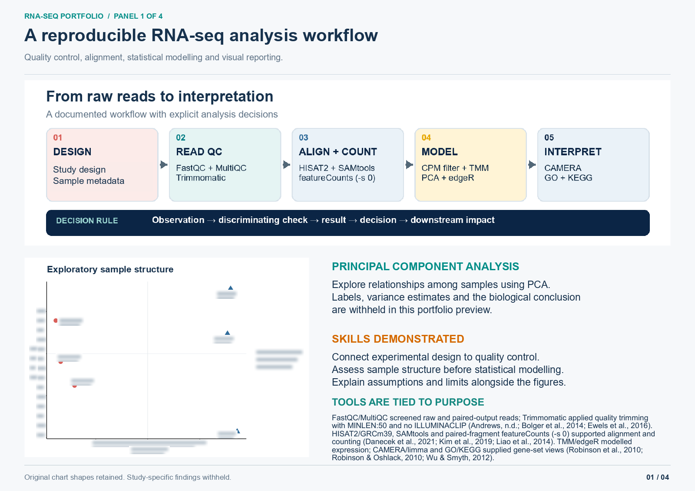
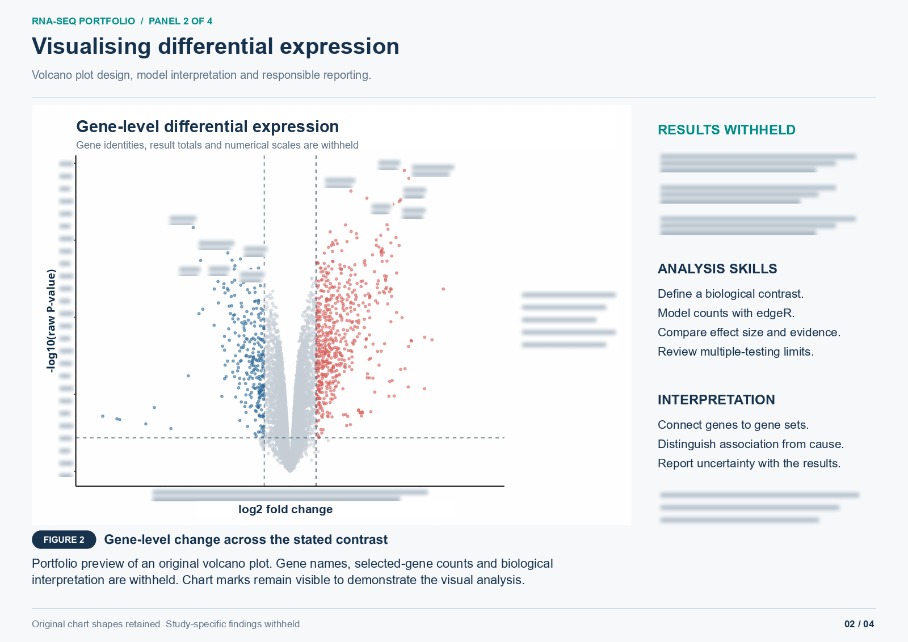
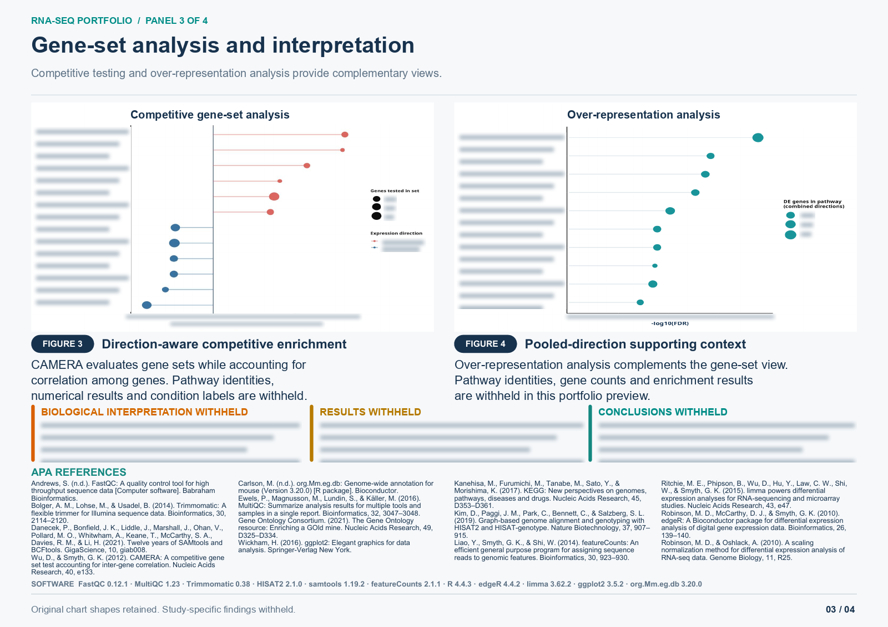
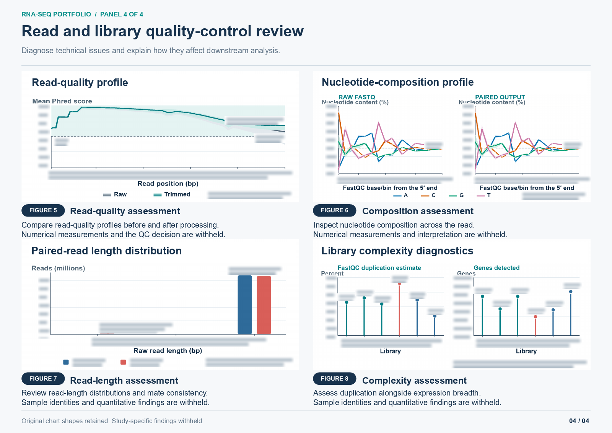

# RNA-seq poster portfolio

This poster demonstrates my work on a bulk RNA-seq pipeline, from read quality control to expression analysis, gene-set analysis and scientific reporting.

These are portfolio copies of my original graphs. Chart shapes remain visible; study labels, gene and pathway names, numerical findings and biological conclusions are deliberately withheld. Blurred placeholders replace the removed text. Raw reads, count matrices, per-sample measurements, result tables and editable poster sources are not included.

[View the four-page poster PDF](bulk-rnaseq-portfolio.pdf)

## Skills demonstrated

| Area | Tools and work demonstrated |
|---|---|
| Read and library quality control | FastQC, MultiQC and Trimmomatic; review of quality, composition, read length and library complexity |
| Alignment and quantification | HISAT2, SAMtools and featureCounts; connect aligned reads to a gene-count workflow |
| Exploratory analysis | R and PCA; assess sample relationships and explain analysis assumptions |
| Differential expression | edgeR and TMM; define a contrast, visualise effect sizes and evaluate statistical limitations |
| Gene-set analysis | limma CAMERA, GO and KEGG; compare competitive testing with over-representation analysis |
| Scientific communication | Explain the purpose of each plot, connect methods to decisions, and report limitations alongside results |

## Workflow and exploratory analysis

## Differential expression

## Gene-set analysis

## Quality control

The previews are flattened images. The PDF contains only those same images, with no original text layer, attachments or editable chart data. General method references remain visible in the poster. No scientific analysis was rerun to prepare these portfolio copies.
